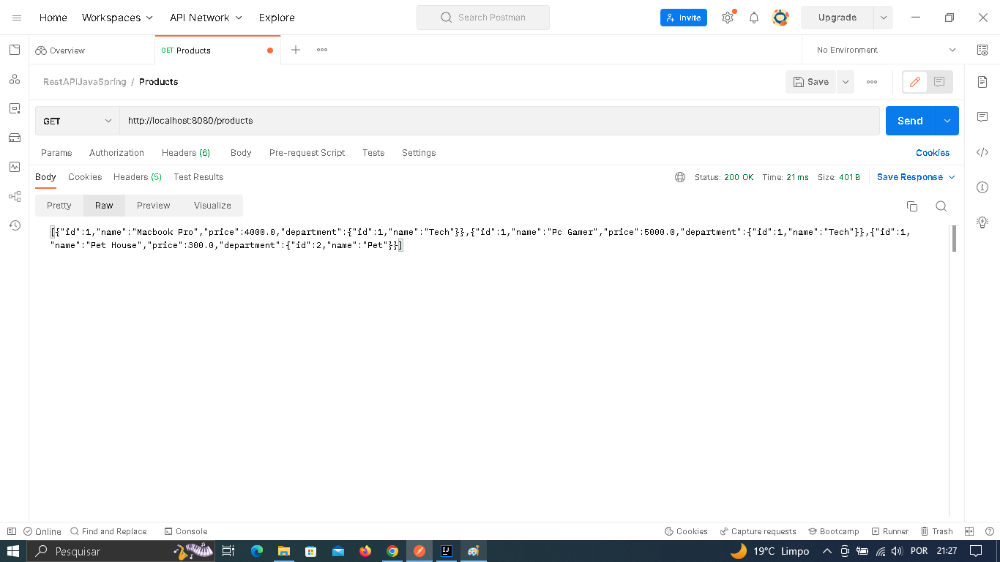

        

# Estudo sobre API REST Java e Spring Boot 💇

## :information_source: Sobre

Esse foi um projeto desenvolvido juntamente com Nélio Alves da DevSuperior!

## :seedling: O projeto <strong>API REST Java e Spring Boot</strong> possui:
<ul>
  <li>A criação de uma API "sap"com Java e Spring Boot;</li>
  <li>API REST que disponibilize o endpoint/produtcs; </li>  
  <li>Instanciados "hard code"</li>
  <li>Modelo de domínio constituído por uma classe Product associado a uma classe Department;</li>
  <li>A estrutura de objetos compostas por 03 products associados a dois departments;</li>
  <li>Utilização do do método GET/products</li>
</ul>

## :seedling: O resultado <strong>esperado deve</strong> apresentar:
<ul>
  <li>Uma lista na forma de JSON;</li>
  <li>Sendo obtido através do endereço: http://localhost:8080/products;</li>  
</ul>

## :seedling: Requisitos Mínimos

Vontade de aprender.

## :rocket: Material de Referência e Tecnologias Utilizadas

O projeto foi desenvolvido utilizando as seguintes tecnologias

- Java 17. 
- Spring Boot 3.06 (https://start.spring.io/).
- Dependência: Spring Web.
- Maven.
- Documentação das respectivas tecnologias. 

## 🚀 Let's code! 🚀